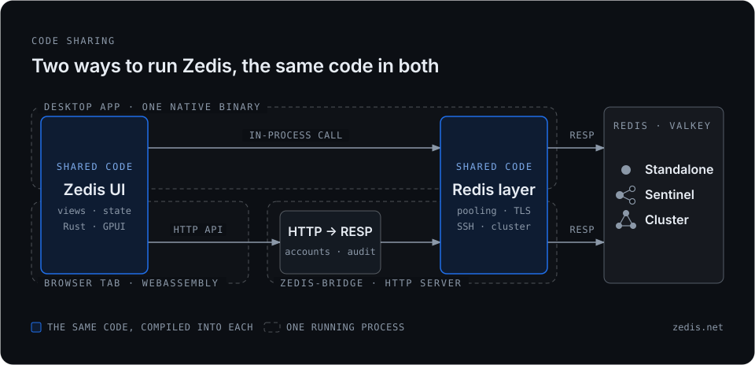

中文 | [English](./README.md)

<h1 align="center">Zedis</h1>

<p align="center">
  <strong>能打开你那个百万 key 库、还不转圈的 Redis GUI —— 原生 GPU 加速，由 Rust 🦀 与 GPUI ⚡️ 驱动</strong>
</p>

<p align="center">
  <a href="LICENSE"></a>
  <a href="https://x.com/tree_xie"></a>
  
  <a href="https://www.blazingly.fast"></a>
</p>

<p align="center">
  <a href="#-功能">功能</a> ·
  <a href="#-安装">安装</a> ·
  <a href="#-web-版自托管">Web 版</a> ·
  <a href="./docs/FEATURES_zh.md">完整功能巡览</a> ·
  <a href="https://zedis.net/zh/">官网</a>
</p>

<p align="center">
  <video src="https://github.com/user-attachments/assets/d7007ecf-bbfd-4e68-bbaf-437091f711e7" autoplay loop muted playsinline width="100%"></video>
</p>

---

## ✨ 功能

**Zedis** 是原生的 Redis / Valkey GUI。[GPUI](https://zed.dev)（Zed 编辑器的渲染引擎）在 GPU 上画每一帧，`SCAN` 结果虚拟滚动，百万 key 也能保持 60+ FPS 和很低的内存占用。

- 🧠 **看得懂你的数据** —— 自动解压、自动解码：JSON、Protobuf、MessagePack、JWT、图片等等，每种 Redis 类型和模块都有专用查看器。
- 📊 **可观测性就在同一个窗口** —— 实时指标、内存分析、热点 key、慢日志、`MONITOR`、集群健康。
- 🔐 **生产环境锁得住** —— Prod 连接默认锁写，破坏性命令要输入服务器名，密钥按机器加密，没有任何遥测。
- 🌐 **连你真正在跑的东西** —— TLS、SSH、Cluster、Sentinel；Redis 与 Valkey 同为一等公民；Dragonfly、代理和云托管缺什么会灰显并说明原因。
- ⌨️ **给天天盯着 Redis 的人** —— ⌘K、带补全的 redis-cli、AI 命令助手、跨服务器复制与对比，同一套应用也能跑在浏览器里。

已经在用 Redis Insight、ARDM 或 Tiny RDM？**粘贴导出文件，所有连接一次迁入。**

📖 **[每个面板、查看器和快捷键 →](./docs/FEATURES_zh.md)**

## 📦 安装

### macOS

```bash
brew install --cask zedis
```

### Windows

```bash
scoop bucket add extras
scoop install zedis
```

### Linux

Arch Linux（AUR）：

```bash
yay -S zedis-bin
```

其他发行版：每个 [release](https://github.com/vicanso/zedis/releases/latest) 都附带 `.deb`、`.rpm`、AppImage 和普通 tarball（x86_64 与 aarch64）。

<details>
<summary><strong>用 Cargo 从源码编译</strong></summary>

Zedis 依赖的是 GPUI 的未发布（git）版本，而 crates.io 不允许带 git 依赖发布，所以 crates.io 上的版本可能滞后。想用最新版，请用上面的包管理器、[下载发布版](https://github.com/vicanso/zedis/releases)，或使用下面的 `--git` 命令。

```bash
# 来自 crates.io —— 可能是较旧的版本
cargo install --locked zedis-gui

# 最新版：直接从 GitHub 源码编译（会解析 git 依赖）
cargo install --git https://github.com/vicanso/zedis --locked zedis-gui
```

</details>

## 📸 截图

<!--
  方案 A —— 图片托管在 GitHub:把每张截图拖进任意 issue/PR 评论(或 release),
  得到 https://github.com/user-attachments/assets/... 链接,然后替换下面的
  REPLACE-* 占位符。点击缩略图打开原图;width="260" 让三列网格约占一屏。
  建议截图(按重要性):
    1. key-browser     —— 命名空间树 + JSON / 语法高亮的值编辑器
    2. memory-analyzer —— Top-N 表 + TTL 直方图 + 体检建议
    3. live-metrics    —— 实时 GPU 图表(CPU / 内存 / 网络)
    4. geo-map         —— sorted set 画在雷达上
    5. vector-set      —— 向量集 + KNN(VSIM)结果
    6. command-palette —— ⌘K 命令面板
-->

<table>
  <tr>
    <td><a href="https://github.com/user-attachments/assets/c06e4d80-7607-4d6c-807e-2a62a2ee556f"></a></td>
    <td><a href="https://github.com/user-attachments/assets/88091f50-ec77-41d5-acda-047a835079f8"></a></td>
    <td><a href="https://github.com/user-attachments/assets/d5801a8c-da94-461b-83b6-6c9b70e2007d"></a></td>
  </tr>
  <tr>
    <td align="center"><sub>键浏览与数据查看</sub></td>
    <td align="center"><sub>内存分析器</sub></td>
    <td align="center"><sub>实时指标</sub></td>
  </tr>
  <tr>
    <td><a href="https://github.com/user-attachments/assets/2525cec9-5dd6-4049-9ea9-60fcb4cc249f"></a></td>
    <td><a href="https://github.com/user-attachments/assets/b4733051-2965-40ff-9d49-6bb909551513"></a></td>
    <td><a href="https://github.com/user-attachments/assets/4335c12b-cbca-467e-abd9-7b50ffd568c5"></a></td>
  </tr>
  <tr>
    <td align="center"><sub>地理地图</sub></td>
    <td align="center"><sub>向量集 + KNN</sub></td>
    <td align="center"><sub>命令面板(⌘K)</sub></td>
  </tr>
</table>

## 🌐 Web 版（自托管）

同一套 GUI，编译成 WebAssembly。部署在 Redis 旁边，打开浏览器标签页就能用。`zedis-bridge` 提供页面并代替浏览器访问 Redis —— 密码只保存在 bridge 上（加密存储），不会到达页面。

<p align="center">
  
</p>

```bash
docker run -d --name zedis-web -p 7379:7379 \
  -e ZEDIS_BRIDGE_USERS="admin@change-me" \
  -v zedis-data:/data \
  vicanso/zedis-web:latest --listen 0.0.0.0:7379 --insecure-cookie
```

打开 <http://localhost:7379>，用 `admin` / `change-me` 登录。这条命令只适合纯 http 试用：正式使用请去掉 `--insecure-cookie`，并在前面加上 HTTPS。

- **账号、角色、SSO** —— 必须登录；条目默认私有；账号可以只读或只能看到部分服务器；身份可以来自反向代理写入的请求头。
- **生产环境默认锁写** —— Prod 每次解锁 15 分钟；审计日志记录登录、条目变更和每条经确认的命令。
- **MCP** —— Claude Code、Cursor 或任何 MCP 客户端以只读账号读 Redis，每次调用都留审计。

> **早期预览。** linux/amd64 与 linux/arm64（约 26 MB）。部分桌面面板在浏览器里不可用，指南里有清单。

📖 **[自托管：HTTPS、账号、SSO、审计日志、MCP →](./docs/WEB_zh.md)**

## 🔀 Redis 与 Valkey

Valkey 在这里是一等公民，不是兼容模式。每个依赖版本的功能都为两者分别设了门槛，服务器不会收到它没有实现的命令。Valkey 独有的功能（`COMMANDLOG`、原子槽迁移、集群多数据库）都有对应面板。Redis 与 Valkey 之间的复制两个方向都能落地，即使 `DUMP` 载荷互不相认。每次改动都会跑 Redis 6.2–8 和 Valkey 8.0–9.1 的集成测试。Dragonfly 也能连接：会按它自己的版本号识别并显示，它没有的命令经探测后不再提供 —— 目前它还不在 CI 矩阵里。

📖 **[兼容矩阵 →](./docs/REDIS_VALKEY_zh.md)**

## 📚 文档

- **[完整功能巡览](./docs/FEATURES_zh.md)** —— 每个面板、查看器和快捷键。
- **[Web 版：自托管指南](./docs/WEB_zh.md)** —— 部署、账号、SSO、审计日志与 MCP。
- **[Redis 与 Valkey](./docs/REDIS_VALKEY_zh.md)** —— 两者的差异，以及它们之间的复制如何工作。
- **[安全策略](./SECURITY.md)** · **[更新日志](./CHANGELOG.md)**

---

## 🔏 代码签名策略（Code signing policy）

macOS 版本使用维护者的 Apple Developer ID 签名并公证。

**团队**

- 提交者与审阅者（committers / reviewers）：[@vicanso](https://github.com/vicanso)
- 审批者（approvers）：[@vicanso](https://github.com/vicanso)

团队之外的改动一律以 pull request 提交，由提交者审阅后合并。

**隐私声明**

本程序不会向其他联网系统传输任何信息，除非用户或安装、运行本程序的人明确要求；仅有以下两处例外，且都由你掌控：

- **更新检查。** 启动时（最多每两天一次）Zedis 会从 GitHub Releases 下载发布清单，判断是否有新版本。**若 GitHub 无法访问**，同一请求会改用 [Gitee 镜像](https://gitee.com/vicanso/zedis)——发布流程会把每个正式版本原样复制过去——因此在访问不了 GitHub 的网络里，检查和下载依然可用。无论走哪一个地址，请求都只带应用版本号（`User-Agent`），不含任何关于你、你的机器或数据的信息；下载会用发布清单里的 SHA-256 校验，所以镜像若提供了别的内容，会和传输损坏一样被拒绝。可在 *设置 → 自动检查更新* 中关闭；新版本只有在你点击更新时才会下载。
- **AI 助手。** 只有在 *设置 → AI 服务地址* 中填入了端点之后，你明确交给它的文本（命令描述、内存报告）才会发送到该端点，不会发往别处。

你的 Redis 服务器、SSH 隧道和可选代理只连接到你指定的地址。Zedis 没有遥测，也不会上传崩溃报告：崩溃报告只保存在本地，直到你自己导出诊断包。

---

## 🤝 参与贡献

欢迎提交 issue 或 PR —— 新功能、翻译、修 bug 都可以。提交 PR 即表示你同意[贡献者许可协议（CLA）](./CLA.md)。

## 📄 许可证

Zedis 是根据 [Apache License 2.0](./LICENSE) 授权的开源软件。
